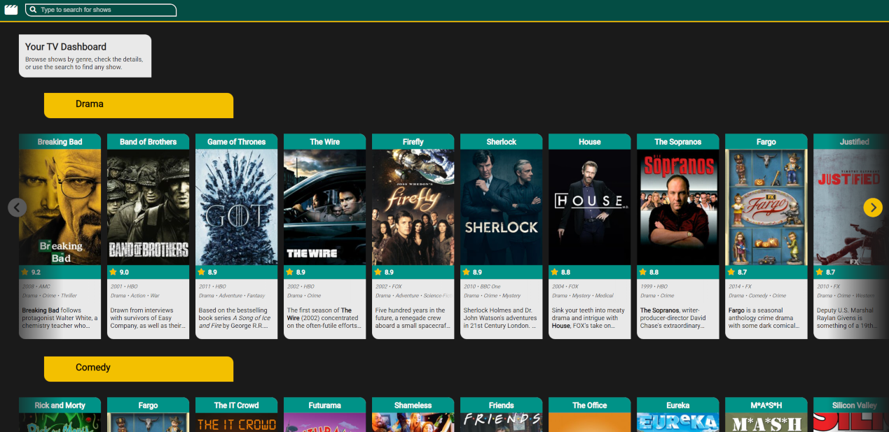

# TVShowDashboard

TVShowDashboard is an application that allows users to browse TV shows by genre, view key details (e.g., rating, network, runtime), and search for shows not visible in the main overview.

## Preview



## Table of Contents

- [Project setup](#project-setup)
  - [Installing dependencies](#installing-dependencies)
  - [Running the project locally](#running-the-project-locally)
  - [Compiling and minifying for production](#compiling-and-minifying-for-production)
  - [Running unit tests](#running-unit-tests)
  - [Deploying](#deploying)
- [Tech stack](#tech-stack)
- [Architecture](#architecture)
  - [Overview](#overview)
  - [Unit tests](#unit-tests)
  - [Styling](#styling)
  - [Other implementation details](#other-implementation-details)
    - [Loading Wrappers](#loading-wrappers)
    - [Dependency on the card width](#dependency-on-the-card-width)
    - [Notes on accessibility](#notes-on-accessibility)
- [Folder structure](#folder-structure)
  - [Infrastructure](#infrastructure)
  - [Models](#models)
  - [Presentation](#presentation)
  - [Presenters](#presenters)
  - [Services](#services)
  - [Store](#store)
- [Known issues](#known-issues)
  - [Behaviour on GitHub Pages](#behaviour-on-github-pages)

## Project setup

### Installing dependencies

```bash
npm ci
```

### Running the project locally

```bash
npm run dev
```

### Compiling and minifying for production

```bash
npm run build
```

### Running unit tests

```bash
npm run test-u
```

### Deploying

```bash
npm run deploy
```

This deploys the application to Github Pages.

_Note: Please also check out the Github Pages related notes under [Known issues](#known-issue)._

## Tech stack

- **Front-end framework:** Vue 3
- **Language:** TypeScript
- **Build tool:** Vite
- **Testing framework:** Vitest
- **CSS Preprocessor:** SCSS
- **Package manager:** NPM
  - Node `v22.21.1`
  - NPM `v10.9.4`

_**Note**: No additional state management or routing libraries (e.g., vue-router, pinia, or vuex) are used. Vue 3’s built-in reactivity is sufficient for handling routing logic and state management in an application of this size. This keeps the bundle lean and improves overall performance._

## Architecture

### Overview

The architecture follows a **Class-based composition API** pattern, combining Vue's Composition API with Object Oriented Programming (OOP).

Component logic is split across multiple files:
   - `name.vue` – template / markup
   - `name.code.ts` – core logic
   - `name.ts` – mediator between logic and template
   - `name.scss` – styling

#### Advantages:
- **Encapsulation**: Logic resides in classes, not scattered in `setup()`.
- **Testability**: Classes can be tested independently.
- **Reusability**: Classes can be reused across components.
- **Consistency**: Both component and non-component logic follow the same structure.

### Unit tests

Unit tests focus on `.code.ts` and other `.ts` files. Component `.ts` and `.vue` files are excluded to focus on core logic. _User interaction flows are better validated through end-to-end testing (e.g., Cypress), which was outside the scope of the MVP._

**Testing style**: Pure black-box testing for functions; external dependencies are mocked. Exceptions include getters and computed properties, which are tested individually but not fully mocked.

_This approach is not applied rigidly. In some cases, private functions used by a public method are tested together when it improves readability and provides clearer coverage of the intended use cases._

### Styling

SCSS is **mobile-first**, with styles defined in ascending breakpoints:

```scss
/* Default CSS */

/* Tablet styles */
@media (min-width: 768px) {	... }

/* Desktop */
@media (min-width: 1024px) { ... }

/* Large screens */
@media (min-width: 1280px) { ... }
```

### Other implementation details

#### Loading Wrappers

`LoadingWrapper` shows either a **loading skeleton** or content, depending on a loading state.

```vue
<LoadingWrapper
	:classes="['ClassOfWrappedElement']"
	:isLoading="isLoading"
	tag="span"
>
	<div class="ClassOfWrappedElement">
		The content to be shown when loading completes
	</div>
</LoadingWrapper>
```

- `classes`: Customises the skeleton’s look; typically matches the top-level element class.
- `isLoading`: Boolean controlling loading state.
- `tag`: Optional HTML tag; defaults to `div`.

#### Dependency on the card width

The `GenreShowcase` component uses `cardWidthInPixels`. It **must be kept in sync** to align cards correctly. **It must match the actual card width across all screen sizes.**

#### Notes on accessibility

Accessibility was a key focus, with most implementations kept simple and intuitive.

The primary exception is the `OptimisedForKeyboardNavigation` logic in the root `app` component. By default, element `outlines` are disabled to provide a cleaner experience for users navigating via mouse or scroll. Pressing Tab adds the class to `PageWrapper`, restoring `outline: auto` to support keyboard users.

## Folder structure

The `src` folder is organised into functional clusters:

### Infrastructure

Classes connecting the app to external packages or dependencies.

### Models

Classes, interfaces, and enums representing entities in the app.

### Presentation

Visual components of the application.

### Presenters

Classes that prepare data for presentation components.

### Services

Classes that handle backend communication and add utility logic.

### Store

Centralised reactive front-end storage.

## Known issues

### Behaviour on GitHub Pages

When the application is deployed to GitHub Pages, a few limitations are present due to the static file hosting environment:

- **Subpath handling:** The app doesn’t fully handle the repository subpath (`/TVShowDashboard/`). Navigating between pages can strip the subpath, causing page refreshes to break the view.
- **Direct page access:** Opening a detail page (e.g., `show-details`) in a new tab results in a 404, because GitHub Pages serves only static files and cannot route requests to the Vue application.

**Workaround:** The application functions correctly if the user stays within a single tab and navigates without refreshing the page.

For the full experience, it’s recommended to run the **application locally** (see [Running the project locally](#running-the-project-locally)).